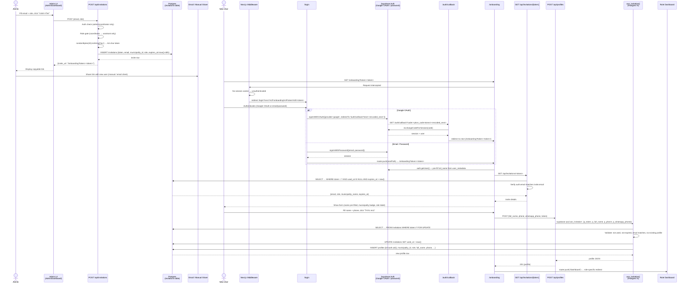
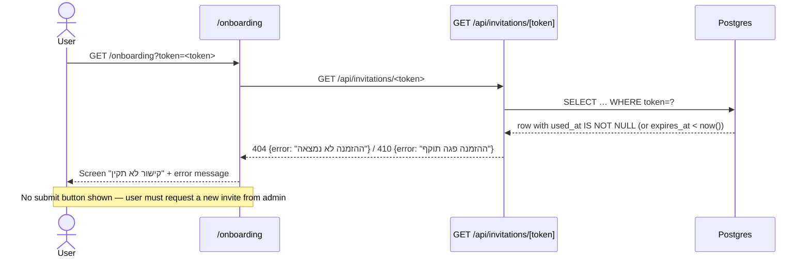
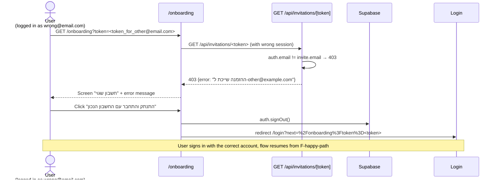
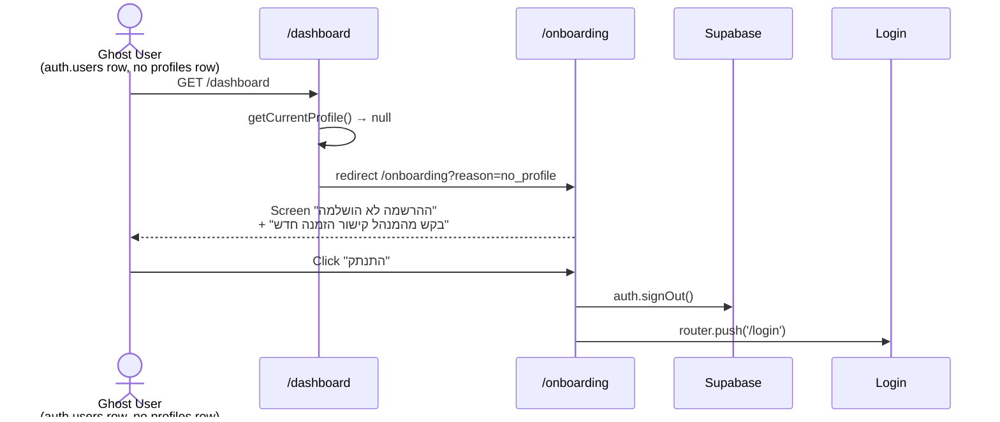

# User Invitation & Admin Hierarchy — Research Document

**Last updated:** 2026-04-02  
**Status:** Current implementation (post-hardening)  
**Scope:** SubTrack invite-only onboarding system

---

## 1. Complete Invitation Journey

### 1.1 Happy Path — Sequence Diagram



---

### 1.2 Failure States

#### F1 — Expired or Already-Used Token



#### F2 — Wrong Session (Authenticated as Different Email)



#### F3 — Ghost User (Authenticated, No Profile, No Token)



---

## 2. Role Hierarchy

SubTrack uses four roles stored in a Postgres `user_role` enum. Roles are **tenant-scoped** except `super_admin`.

| Role | Tenant Scope | Description |
|------|-------------|-------------|
| `super_admin` | Cross-tenant (all municipalities) | Platform owner; can manage all orgs, see all data, perform any admin action |
| `admin` | Single municipality | Org manager; full control within their municipality |
| `coordinator` | Single municipality | School/unit coordinator; manages assistants assigned to their schools |
| `assistant` | Single municipality | Substitute teacher; read-only access to own schedules |

### 2.1 Role Routing (after login)

After profile creation, `/dashboard` reads the profile role and redirects:

```
super_admin  → /admin/super
admin        → /admin
coordinator  → /coordinator
assistant    → /assistant
```

### 2.2 Admin vs Super Admin — Scope Comparison

| Capability | `admin` | `super_admin` |
|-----------|---------|---------------|
| View own municipality data | ✅ | ✅ |
| View other municipalities' data | ❌ | ✅ |
| Create invitations for own municipality | ✅ | ✅ |
| Create invitations for any municipality | ❌ | ✅ |
| Promote users to admin within own org | ✅ | ✅ |
| Promote users to admin in other orgs | ❌ | ✅ |
| Create new municipality tenants | ❌ | ✅ |
| Assign `super_admin` role | ❌ | ✅ (direct DB only) |

### 2.3 Super Admin Impersonation

**Current status: Not implemented.**

No impersonation mechanism exists in the current system. A `super_admin` can read cross-tenant data via RLS (the `my_role()` function returns `'super_admin'` and policies grant full access), but there is no "act-as" session switching.

**Gap for support use cases:** If a super admin needs to debug a municipality-specific issue from a user's perspective, they currently must:
1. Create a test invitation for that municipality
2. Sign in with a separate test account

**Recommended future approach:** Add a `impersonating_municipality_id` claim to the JWT (via Supabase custom claims or a server-side session cookie) that overrides `my_municipality_id()` for the duration of a support session. This requires an audit log entry and an explicit "end impersonation" action.

---

## 3. Role-Permission Matrix — Invitation CRUD

| Action | `assistant` | `coordinator` | `admin` | `super_admin` |
|--------|------------|---------------|---------|---------------|
| **Create invitation** — `assistant` role | ❌ | ✅ (own municipality) | ✅ (own municipality) | ✅ (any municipality) |
| **Create invitation** — `coordinator` role | ❌ | ❌ | ✅ (own municipality) | ✅ (any municipality) |
| **Create invitation** — `admin` role | ❌ | ❌ | ❌ | ✅ (any municipality) |
| **Create invitation** — `super_admin` role | ❌ | ❌ | ❌ | ❌ (direct DB only) |
| **Read pending invitations** | ❌ | ✅ (own municipality) | ✅ (own municipality) | ✅ (all) |
| **Revoke / delete invitation** | ❌ | ❌ | ✅ (own municipality) | ✅ (all) |
| **Resend invitation link** | ❌ | ✅ (own municipality) | ✅ (own municipality) | ✅ (all) |

> **Note:** "Revoke" and "Resend" are planned capabilities. The current API exposes `POST /api/invitations` (create) and `GET /api/invitations` (list pending). Delete/resend endpoints are not yet implemented.

### 3.1 Coordinator Role-Gate Detail

When a `coordinator` creates an invitation via `POST /api/invitations`, the server enforces:

```typescript
if (callerRole === 'coordinator' && role !== 'assistant') {
  return 409 { error: 'רכזים יכולים להזמין מסייעות בלבד' }
}
```

This prevents privilege escalation — a coordinator cannot invite another coordinator or admin.

---

## 4. Security: Link-Based vs Email-Only Invites

### Current Approach: Link-Based (Token in URL)

The invite URL is `https://<host>/onboarding?token=<64-char-hex>`. The link is generated server-side and displayed in the admin UI for manual sharing.

| Property | Link-Based (current) | Email-Only |
|----------|---------------------|------------|
| **Distribution channel** | Admin copies & pastes into any channel (WhatsApp, email, etc.) | System sends email directly |
| **Token entropy** | 256 bits (32 random bytes) — brute-force infeasible | Same |
| **Email binding** | Server validates `auth.email == invite.email` at use-time | Token sent to correct mailbox (implicit binding) |
| **Interception risk** | Link can be forwarded to wrong person; email binding is the backstop | Lower — only the inbox owner can receive it |
| **TTL** | 48 hours | 48 hours (recommended) |
| **Delivery reliability** | Admin controls; no dependency on SMTP | Depends on transactional email provider |
| **Audit trail** | `invitations.created_by` + `used_at` | Same + email delivery receipt |
| **Implementation complexity** | Low | Requires transactional email integration (Resend, SendGrid, etc.) |

**Current security posture:** Acceptable for the target environment (Israeli municipalities, WhatsApp-native communication culture). Email binding on the server side means even if the link is forwarded, only the intended recipient can complete onboarding.

**Recommended upgrade path:** Add Resend (or similar) integration to send the link automatically. Keep the manual-copy fallback for admins who prefer it. This removes the admin copy-paste step and adds a delivery audit trail.

---

## 5. Multi-Tenancy: Invitation State in Supabase

Every invitation row carries `municipality_id`, which ties it to a single tenant. RLS policies enforce this:

```sql
-- Admins/coordinators see only own municipality's invitations
create policy "staff reads own municipality invitations"
  on invitations for select to authenticated
  using (municipality_id = my_municipality_id());

-- super_admin bypass
create policy "super_admin reads all invitations"
  on invitations for select to authenticated
  using (my_role() = 'super_admin');
```

The `use_invitation()` function runs as `security definer` (with `search_path = public, pg_temp`) so it can write to `profiles` even before the caller has a profile row (no RLS would match an unauthenticated profile state). It validates the caller's email from `auth.users` directly — never trusting client-supplied email.

### 5.1 Invitation Lifecycle States

```
PENDING  →  USED
         ↘  EXPIRED  (automatic: expires_at < now())
```

There is no explicit `status` column — state is derived:

| Condition | Derived State |
|-----------|--------------|
| `used_at IS NULL AND expires_at > now()` | **Pending** |
| `used_at IS NOT NULL` | **Used** |
| `used_at IS NULL AND expires_at <= now()` | **Expired** |

The `/api/invitations` list endpoint filters to `pending` only (`used_at IS NULL AND expires_at > NOW()`).

---

## 6. Token Design Rationale

- **Format:** 64 lowercase hex characters (`[0-9a-f]{64}`) — encodes 32 random bytes (256 bits of entropy)
- **Generation:** `crypto.randomBytes(32).toString('hex')` — Node.js CSPRNG, not `Math.random()`
- **Storage:** Plaintext in `invitations.token` (unique index). Acceptable because:
  - 256-bit token is effectively unguessable
  - Token is single-use and short-lived (48 hours)
  - If the DB is compromised, tokens expire quickly
  - Hashing would add complexity with minimal practical benefit at this scale
- **Uniqueness:** Postgres `UNIQUE` constraint on `token` column; the 2^256 space makes collision astronomically unlikely
- **Validation regex:** Applied at both the API layer (Zod: `/^[0-9a-f]{64}$/`) and inside `use_invitation()` (token lookup fails fast on malformed input)

---

## 7. Open Gaps & Recommendations

| # | Gap | Severity | Recommendation |
|---|-----|----------|----------------|
| 1 | No transactional email — admin must manually share link | Medium | Integrate Resend; keep manual fallback |
| 2 | No invite revocation endpoint | Medium | Add `DELETE /api/invitations/[token]` (admin only) |
| 3 | No resend / token refresh endpoint | Low | Add `POST /api/invitations/[token]/resend` to extend TTL |
| 4 | Super admin impersonation not implemented | Low | JWT custom claim approach (see §2.3) |
| 5 | `super_admin` role can only be assigned via direct DB access | Low | Add a protected bootstrap migration + CLI script |
| 6 | No invitation audit log beyond `used_at` | Low | Add `invite_events` table for create/view/revoke events |
